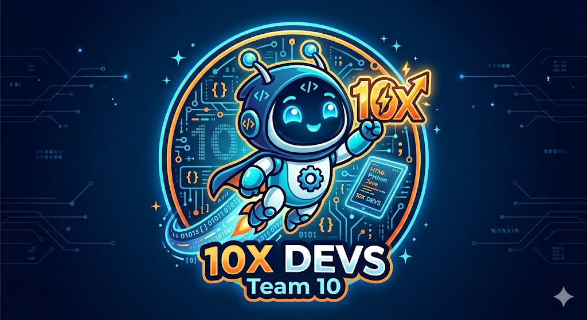

# 🚀 Team 10 - 10x Devs

## 🎨 Brand & Identity

**Team Name:** 10x Devs

  

Our logo, featuring **'Volt'** the robotic dev sprite, is a symbol of dynamic innovation. Rendered with our core color palette, it showcases '10x' as a powerful, precision-engineered bolt and arrow, signifying exceptional velocity, scale, and a passion for technology that pushes boundaries.

**Mission:** To design, build, and ship a high-quality product while growing as engineers and collaborators.

**Values:**
- 🤝 Respect
- ✅ Accountability
- 🔍 Transparency
- 💎 Quality
- 📈 Growth

## 👥 Roster

### Evan Marriott — *Team Lead*

| | |
|---|---|
| **GitHub** | [@evangmarriott](https://github.com/evangmarriott) |
| **Major** | Computer Science |
| **Year** | 2nd Year |

**About me:** I love playing basketball and poker, and going to the beach. Right now, I'm working on an AI implementation tool for a law firm in San Francisco.

**Fun fact:** I love to travel and have visited 6 out of the 7 continents.

---

### Nicole Sutedja — *Team Lead*

| | |
|---|---|
| **GitHub** | [@nicolesutedja](https://github.com/nicolesutedja) |
| **Major** | Computer Science |
| **Year** | 2nd Year |

**About me:**  I love to explore the possibilities of technology and how it can help our community. I am passionate about programming, working alongside a team, event planning, and learning new things every day. 

**Fun fact:** I love to play tennis and video games!

---

### Prakhar Shah — *Frontend*
 (optional)

| | |
|---|---|
| **GitHub** | [@username](https://github.com/username) |
| **Major** | [Major] |
| **Year** | [Year] |

**About me:** [2-3 sentences about yourself, your interests, or what you're working on]

**Fun fact:** [Something interesting about you]

---

### Aron Wu — *Backend*

| | |
|---|---|
| **GitHub** | [@username](https://github.com/username) |
| **Major** | [Major] |
| **Year** | [Year] |

**About me:** [2-3 sentences about yourself, your interests, or what you're working on]

**Fun fact:** [Something interesting about you]

---

### Jensen Guo — *QA / Testing*

| | |
|---|---|
| **GitHub** | [@username](https://github.com/username) |
| **Major** | [Major] |
| **Year** | [Year] |

**About me:** [2-3 sentences about yourself, your interests, or what you're working on]

**Fun fact:** [Something interesting about you]

---

### Xuanye Wang — *Design / UI-UX*

| | |
|---|---|
| **GitHub** | [@KeeevinW](https://github.com/KeeevinW) |
| **Major** | Computer Science |
| **Year** | Third Year |

**About me:** Currently I am working for a startup as a full-stack developer / MLE. I have played golf for 16 years.

**Fun fact:** I'm a huge Bayern Munich fan.

---

### Kaley — *DevOps / CI-CD*

| | |
|---|---|
| **GitHub** | [@chungkaley](https://github.com/chungkaley) |
| **Major** | Computer Science |
| **Year** | 3rd Year |

**About me:** I enjoy working on technology solutions that are meaningful to my community. Outside of academics, I like to draw and make graphics.

**Fun fact:** I used to do ballet.

---

### Han Yang-Lin — *Documentation*

| | |
|---|---|
| **GitHub** | [@hyanglin0](https://github.com/hyanglin0) |
| **Major** | Computer Science |
| **Year** | 2nd Year |

**About me:** I love running and playing guitar. I enjoy programming, developing games, and making small tools that make life easier.

**Fun fact:** My fastest mile is 4:26.

---

### Benedict Luis — *Frontend*

| | |
|---|---|
| **GitHub** | [bluis1](https://github.com/bluis1) |
| **Major** | Computer science |
| **Year** | 3rd year |

**About me:** [Outside of programming, I really enjoy tennis, piano, and art. They help me stay creative and give me a good balance between being active and relaxing. Lately, I’ve been spending time improving my programming skills too.]

**Fun fact:** [I can move my ears and make water droplet noise out of my cheeks]

---

### Bethany Miyamoto — *Frontend*

| | |
|---|---|
| **GitHub** | [@username](https://github.com/b3-m0) |
| **Major** | Computer Science |
| **Year** | 2nd Year |

**About me:** [I love animals, art, and flag football. I enjoy programming and researching machine learning methods.]

**Fun fact:** I used to horseback ride.

---

### Hudson — *Data*

| | |
|---|---|
| **GitHub** | [@hdgehrke](https://github.com/hdgehrke) |
| **Major** | Math - Computer Science |
| **Year** | 4th Year |

**About me:** I enjoy several sports, including ice hockey, field hockey, and triathlon. I like various machine learning methods, especially neural networks. I am trying to learn more about systems programming and operating systems.

**Fun fact:** I have raced a half-ironman

---

*Last updated: April 2026*
